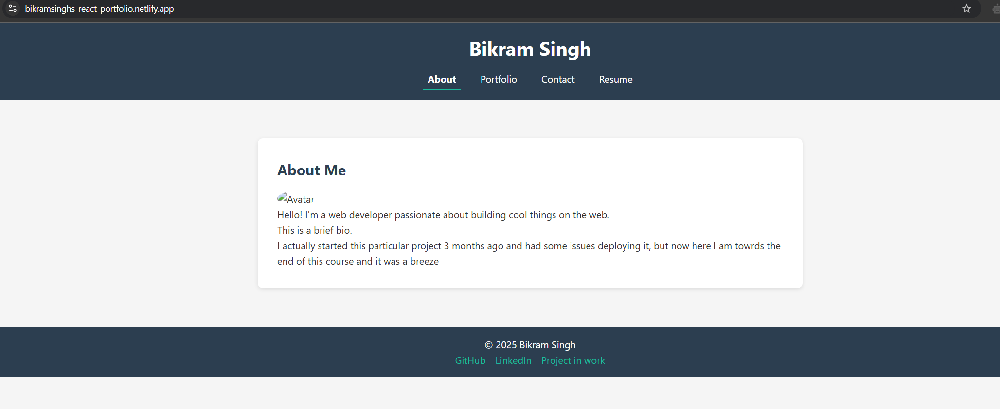
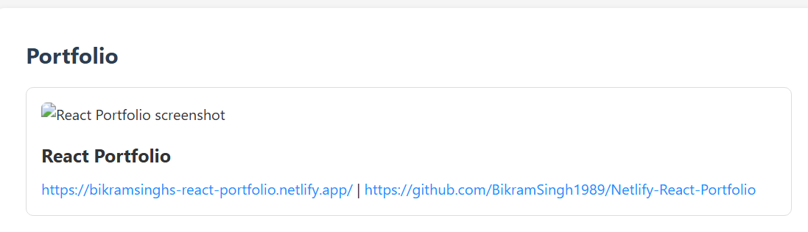

# Netlify React Portfolio

## 📸 Live Site  
🔗 [View Deployed Portfolio on Netlify](https://bikramsinghs-react-portfolio.netlify.app/p)

## 📁 Repository  
🔗 [View Source Code on GitHub](https://github.com/BikramSingh1989/Netlify-React-Portfolio)

---

## 📖 Description

This is a responsive single-page **React portfolio** built with **Vite** and deployed to **Netlify**. It showcases my skills as a web developer through featured projects, a downloadable resume, and a functional contact form. The portfolio uses React components to create a modular, scalable UI.

---

## 🔧 Technologies Used

- React
- Vite
- JSX
- CSS3
- Git & GitHub
- Netlify 
- react-router-dom 
- Form validation 

---

## 🎯 Features

✅ Responsive design (mobile-first)  
✅ About Me section with avatar and bio  
✅ Portfolio section with project cards  
✅ Project links to GitHub and deployed apps  
✅ Contact form with input validation  
✅ Resume section with proficiencies list and PDF download  
✅ Footer with external profile links  
✅ Smooth navigation between sections (using React Router)  

---

## 🖼️ Screenshots

### 🔹 Home / About Section

### 🔹 Portfolio Section

---

## 📄 License

This project is open-source and available under the [MIT License](LICENSE).

---